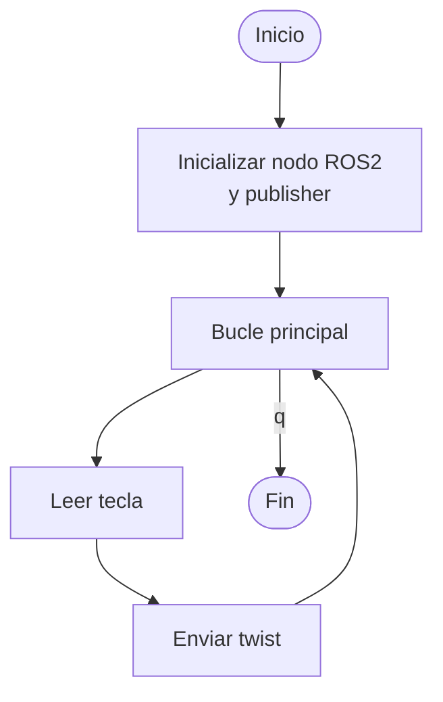

# Lab-04-Robotica-2025-2
Laboratorio 4 de Robótica 2025-2s, realizado por Jeison Diaz y Mateo Ramos

# Integrantes
1. Jeison Nicolás Diaz Arciniegas [jediazar@unal.co](JeisonD0819)
2. Mateo Ramos Cujer [mramoscu@unal.edu.co](MateoKGR)

# Informe

Indice:
1. [Objetivos](#objetivos)
2. [Procedimientos realizados](#procedimientos_realizados)
3. [Decisiones de diseño](#decisiones_de_diseño)
4. [Funcionamiento general](#funcionamiento_general)
5. [Diagrama de flujo](#diagrama_de_flujo)

## Objetivos
## Procedimientos realizados
## Decisiones de diseño
## Funcionamiento general
## Diagrama de flujo

