# Lab-04-Robotica-2025-2
Laboratorio 4 de Robótica 2025-2s, realizado por Jeison Diaz y Mateo Ramos

# Integrantes
1. Jeison Nicolás Diaz Arciniegas [jediazar@unal.co](JeisonD0819)
2. Mateo Ramos Cujer [mramoscu@unal.edu.co](MateoKGR)

# Informe

Indice:
1. [Objetivos](#objetivos)
2. [Procedimientos realizados](#procedimientos_realizados)
3. [Decisiones de diseño](#decisiones_de_diseño)
4. [Funcionamiento general](#funcionamiento_general)
5. [Diagrama de flujo](#diagrama_de_flujo)

## Objetivos

- Familiarizarse con la arquitectura de ROS2 (nodos, tópicos, mensajes y servicios).
- Implementar un nodo en Python capaz de publicar mensajes del tipo `Twist` para controlar el simulador *turtlesim*.
- Utilizar el servicio `/reset` de turtlesim para reiniciar la posición y orientación de la tortuga.
- Desarrollar un sistema de lectura de teclado en tiempo real que permita el control manual de la tortuga (flechas) y la ejecución de trayectorias predefinidas para dibujar letras.
- Consolidar en un mismo programa la interacción entre tópicos, servicios y entrada del usuario.

## Procedimientos realizados

## 🛠️ Procedimientos Realizados

Para desarrollar este laboratorio comenzamos por preparar todo el entorno de trabajo necesario para ejecutar ROS2 Humble. Primero instalamos **Ubuntu 22.04**, ya que es la distribución compatible con esta versión de ROS. Una vez dentro del sistema, seguimos cuidadosamente las guías proporcionadas por el laboratorio para familiarizarnos con Linux y con los fundamentos de ROS2. Estas guías fueron esenciales, especialmente las de instalación de ROS2 Humble y la del paquete *turtlesim*, disponibles en los siguientes repositorios:

- https://github.com/labsir-un/ROB_Intro_Linux.git  
- https://github.com/labsir-un/ROB_Intro_ROS2_Humble.git  
- https://github.com/labsir-un/ROB_Intro_ROS2_Humble_Turtlesim.git  

Con estas referencias configuramos las variables de entorno, añadimos ROS2 al `bashrc` y verificamos que los comandos básicos estuvieran funcionando. Luego instalamos *turtlesim* y realizamos pruebas iniciales ejecutando el nodo gráfico para asegurarnos de que todo estuviera funcionando correctamente. También exploramos sus tópicos, servicios e interfaces para entender cómo íbamos a controlarlo desde nuestro propio nodo.

Una vez preparado el entorno, comenzamos a desarrollar nuestro nodo principal en Python, llamado **TurtleController**. Lo primero fue importar `rclpy` y crear la estructura básica del nodo. Después configuramos un **publisher** que envía mensajes del tipo `Twist` al tópico `/turtle1/cmd_vel`, que es el encargado de controlar la velocidad de la tortuga. Paralelamente configuramos un **cliente** del servicio `/reset` usando `std_srvs/srv/Empty` para poder reiniciar la posición y orientación de la tortuga cada vez que se selecciona una letra.

Con la parte de ROS funcionando, pasamos al siguiente reto: crear un sistema que nos permitiera leer el teclado en tiempo real sin necesidad de presionar Enter. Para lograr esto utilizamos las librerías `sys`, `termios` y `tty`, con las cuales desarrollamos la función `get_key()`. Gracias a esto fue posible capturar teclas especiales como las flechas y también las letras que activan cada rutina.

Cuando ya podíamos leer teclas, empezamos a construir las funciones encargadas de dibujar cada letra (M, A, R, C, J, N, D). Para esto usamos cinemática básica: si conocemos la velocidad y el tiempo, podemos controlar la distancia recorrida. Así, cada rutina crea un mensaje `Twist`, ajusta componentes lineales o angulares y lo envía por un tiempo determinado usando `time.sleep()`. Ajustamos valores varias veces hasta que los trazos fueran más legibles dentro del simulador.

Además de dibujar letras, implementamos también un pequeño sistema de control manual. Creamos funciones dedicadas para mover la tortuga hacia arriba, abajo y rotar en ambos sentidos según la flecha presionada. Estas funciones simplemente publican valores constantes al tópico de velocidad, logrando movimientos directos e inmediatos.

Con todas estas piezas listas, estructuramos el **bucle principal del programa**. Este `while True` se encarga de leer continuamente la tecla presionada. Dependiendo de la entrada:
- Si es una letra válida, se llama primero al servicio `/reset` y luego a la rutina correspondiente.
- Si es una flecha, se ejecuta el movimiento manual.
- Si es la tecla `s`, el programa finaliza.

Finalmente, realizamos las pruebas del sistema completo. Ejecutamos el nodo y *turtlesim* simultáneamente, verificando lectura de teclado, dibujos de letras, funcionamiento del servicio y control manual. Durante estas pruebas ajustamos valores de velocidad y tiempos de ejecución para mejorar la claridad de las figuras.

Con todo funcionando correctamente, pasamos a documentar el proceso en el repositorio de GitHub, organizando el código, creando el `README.md` y añadiendo diagramas, instrucciones y explicaciones detalladas del funcionamiento del programa.

## Decisiones de diseño
## Funcionamiento general
## Diagrama de flujo

```mermaid
flowchart TD
A([Inicio del programa])
B[Inicializar rclpy]
C[Crear nodo TurtleController]
D[Crear publisher /turtle1/cmd_vel]
E[Crear cliente servicio /reset]
F[Esperar servicio /reset]
A --> B
B --> C
C --> D
D --> E
E --> F

G{¿Tecla presionada?}
F --> G

H[reset_turtle]
I[Ejecutar rutina de letra]
J[Movimiento manual: Arriba / Abajo / Giro horario / Giro antihorario]
K([Salir del programa])

G -->|Letra J,N,D,A,M,R,C| H
H --> I
I --> G

G -->|Flechas| J
J --> G

G -->|s| K
```

